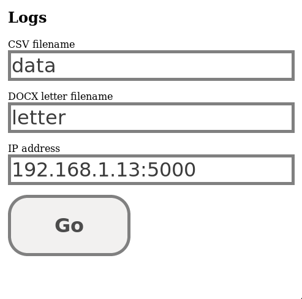

# form-letterer
Creates Word documents from a template and data file.

## Introduction and motivation
I was given a task to generate twenty-five very similar Word documents. They
were letters which meant that each address, addressee, salutation etc. were
different. I didn't want to go through and manually edit each one so I built a
programmatic solution.

Form Letterer is a programmatic form letter generator. It takes a *template*
word document and a *data file* and automatically creates form letters.


Essentially, it's a version of Word's Mail Merge.

## Why not Mail Merge?

I didn't have Microsoft Word on my laptop at the time (lazy to dual boot). This
solution doesn't need Microsoft Word and uses only free software.

As the solution is deployed on a local server, multiple users can use it
without any prior configuration.

Additionally, this solution allows for things that can't be done in Mail Merge
like conditionals and arithmetic. Mail Merge is a simple search-and-replace but
you can do things here like 
```
{{`amount1` * `amount2`}} # multiplication of data values
# 'urgency' is a header row in your data file
{{'URGENT REMINDER' if `urgency` == 'urgent' else 'Reminder:'}} 
```

## Setup

1. `build/` folder
2. `data.csv` data file
3. `letter.docx` template file


### build/ folder
First, **create an empty `build` folder in the shared directory**, as the
letters will be generated there.  

### data.csv
Create a `data.csv` in the same directory (**not inside
build/** !)

The first row of `data.csv` is a header row, which will be what your template
word document refers to. Each subsequent row corresponds to one document to be
created.

Here's an example of a `data.csv` data file.


File names will be generated using the 'name' column of `data.csv`. The name of
the files will be `letter_{name}.docx`. **Please ensure that your data.csv has
a column called 'name'!**

### letter.docx
Create a `letter.docx` file in the same directory.

The .docx file supports csv variables, delineated with ``backticks``, and
arbitrary python code with `{{brackets}}`.


Anything wrapped in ``backticks`` will be grabbed from the CSV's header row.
For example, the program looked up `weapon` and changed it to 'rocket launcher'
for that email.

Anything in `{{brackets}}` will be `eval()'ed`. I often find myself using
`round()` and ternary expressions (`x if y else z`).

### Running

Once `build/`, `data.csv` and `letter.docx` are created, the software is ready
to go.

Finally, open the `index.html` file and fill it in. For iGlobe office, I have
already filled in the IP address.



Press 'Go' and voila! If there are no mistakes in your files, you should see
letters automagically appearing in the `build/` folder. It takes a while for it
to show so please be patient.

## Troubleshooting
Call Zheng Hong at +65 8288 2107 or email me at lieuzhenghong@gmail.com
